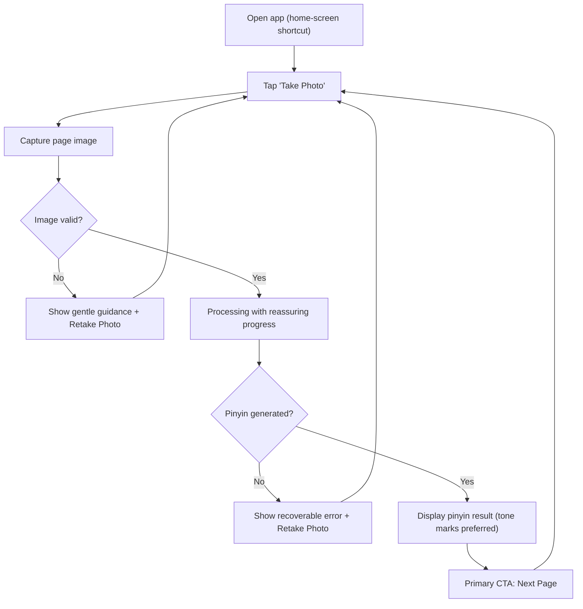
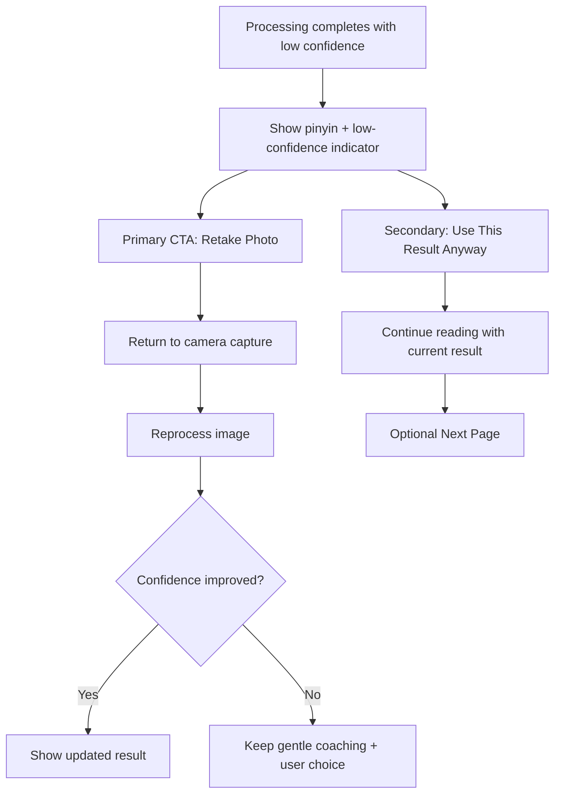
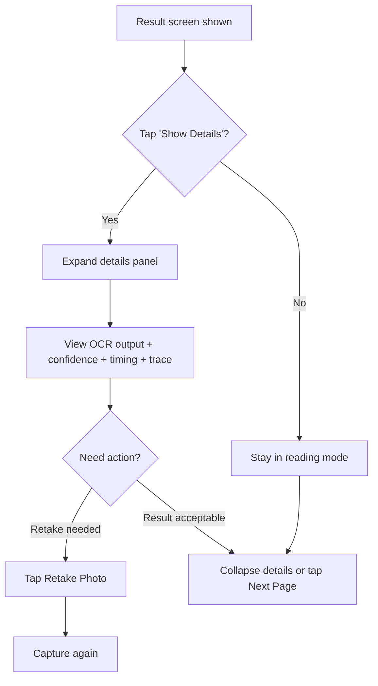

# UX Design Specification test-bmad

**Author:** Clint
**Date:** 2026-03-01T00:19:47Z

---

<!-- UX design content will be appended sequentially through collaborative workflow steps -->

## Executive Summary

### Project Vision

test-bmad is a phone-first reading assistant that converts photos of Chinese children's storybook pages into accurate, sentence-level pinyin so Clint can read naturally with his daughter. The product is intentionally dual-purpose: it must deliver practical reading support while also serving as a hands-on learning platform for LangChain orchestration, tool usage, and skills integration. The UX direction is "accuracy and clarity first, complexity on demand," so the interface stays focused during reading while preserving transparent diagnostics when needed.

### Target Users

Primary user: Clint, an intermediate technical solo builder and parent, using iPhone Safari during live reading sessions.
Primary use context: real-time bedtime or shared reading moments where speed and trust matter, and cognitive load must remain low.
Secondary future context: broader family use and saved-book workflows, including a "compile to book" capability not available in current alternatives.

### Key Design Challenges

1. Trust and correctness under imperfect OCR conditions:
Pleco's OCR experience is not sufficiently accurate for this use case and is optimized for phrase-level interaction, not sentence-level reading continuity.

2. Dual-mode product tension (reader vs. builder):
The interface must support focused reading sessions while also enabling technical introspection for LangChain learning without forcing developer complexity into the default user flow.

3. Mobile-first clarity on iPhone Safari:
The result view must minimize distraction, keep pinyin visually dominant, and ensure toggled metadata/diagnostics remain accessible but non-intrusive.

### Design Opportunities

1. Flow-first "quiet UI" with progressive disclosure:
Show pinyin-first results by default, hide metadata initially, and provide explicit toggles for diagnostics and technical trace data.

2. Confidence-aware trust UX:
Use clear confidence indicators, partial-result messaging, and retry guidance to make uncertainty understandable and actionable instead of opaque.

3. Extensible reading surface:
Design MVP layout to accommodate future English translation and long-term "compile to book" workflows without reworking core interaction patterns.

## Core User Experience

### Defining Experience

The core experience of test-bmad is a repeatable page-reading loop: capture or upload a Chinese storybook page, receive sentence-level pinyin, continue reading, then immediately process the next page. The product succeeds when this loop feels continuous and unobtrusive during live reading with a child. The UX should minimize context switching and keep the user anchored in a single focused flow.

### Platform Strategy

MVP platform is iPhone Safari, touch-first, network-required. The product should be optimized for mobile viewport, tap targets, and camera/photo-library upload behavior typical to Safari on iOS. No offline fallback is required for MVP. A home-screen shortcut is a priority to reduce launch friction and support fast entry into reading sessions.

Future-ready platform considerations include optional pronunciation support (for example read-aloud output) as an enhancement layer, while preserving the same core interaction model.

### Effortless Interactions

The following interactions must feel frictionless:

1. Start processing quickly:
Open from home-screen shortcut and reach image capture/upload with minimal taps.

2. Continuous page progression:
After receiving pinyin for one page, user can immediately process the next page without navigation overhead.

3. Fast perceived completion:
Loading and result transitions should feel lightweight and direct, with clear progress state and no ambiguous waiting.

4. Quiet-by-default output:
Pinyin remains the visual primary focus; metadata/diagnostics stay hidden by default and appear only when toggled.

### Critical Success Moments

1. Uninterrupted reading flow (highest priority):
The user can move from page to page with minimal pause and no UI confusion.

2. Fast pinyin availability:
The user sees usable pinyin quickly enough to continue reading naturally.

3. Trust-preserving uncertainty handling:
When output is uncertain, the system communicates this clearly without derailing the session and enables an obvious retry path.

4. Reliable repeatability:
The same interaction works consistently across consecutive pages in one reading session.

### Experience Principles

1. Flow over features:
Protect the parent-child reading rhythm above all else.

2. One loop, repeated:
Design for fast consecutive page processing, not one-off novelty use.

3. Progressive disclosure by default:
Keep pinyin front and center; reveal diagnostics/metadata only on demand.

4. Mobile realism:
Prioritize iPhone Safari ergonomics, touch efficiency, and launch speed (including home-screen entry).

5. Honest confidence:
Communicate uncertainty clearly and actionably rather than masking it.

## Desired Emotional Response

### Primary Emotional Goals

The primary emotional goal is calm confidence during bedtime reading. The product should reduce stress and cognitive load while helping Clint keep reading flow with his daughter. Speed matters, but only after emotional steadiness is preserved. Over time, the product should build durable trust through consistent and accurate outcomes.

### Emotional Journey Mapping

1. Entry (open app):
Desired feeling is calm and prepared. Launch should feel immediate and familiar, not technical.

2. Processing (upload to result):
Desired feeling is reassured momentum. The app should communicate progress clearly so waiting never feels uncertain.

3. Result (successful conversion):
Desired feeling is quiet completion. No celebratory noise; the pinyin result itself is the value signal.

4. Recovery (uncertain OCR or partial output):
Desired feeling is supported, not blamed. Messaging should coach gently toward a better retry.

5. Return usage (next pages and future sessions):
Desired feeling is trust through repeat reliability, enabling uninterrupted multi-page reading sessions.

### Micro-Emotions

- Confidence over confusion:
Users should feel they can proceed with reading decisions.
- Trust over skepticism:
Output and uncertainty cues should feel honest and dependable.
- Calm over anxiety:
Interface tone and transitions should reduce bedtime-session pressure.
- Momentum over friction:
Page-to-page progression should feel smooth and continuous.
- Satisfaction over hype:
Results should feel quietly correct rather than theatrically "successful."

### Design Implications

- Calm -> low-noise visual hierarchy, minimal default chrome, and predictable interaction patterns.
- Reassuring progress -> explicit but unobtrusive processing indicators with clear state transitions.
- Gentle coaching -> uncertainty and retry messages framed as helpful guidance, not failure alarms.
- Quiet completion -> avoid celebratory animations/sounds; emphasize readable pinyin output immediately.
- Trust -> consistent confidence signaling, stable response formatting, and reliable repeat-loop behavior.

### Emotional Design Principles

1. Calm is the default state.
2. Confidence is earned through clarity and consistency.
3. Progress should reassure, not distract.
4. Recovery language should guide, not punish.
5. Trust compounds through repeatable quiet success.

## UX Pattern Analysis & Inspiration

### Inspiring Products Analysis

1. YouTube (focus behavior)
What works: YouTube frequently gets the interface out of the way when the user is consuming content. Controls are available when needed, but visual emphasis remains on the primary content.

Why this matters for test-bmad:
The pinyin result should be treated as primary content. UI chrome and technical details should recede by default so reading flow remains uninterrupted.

2. OneDrive (upload workflow)
What works: OneDrive's upload flow is smooth, direct, and function-focused. It surfaces relevant actions at the right time without overwhelming the user.

Why this matters for test-bmad:
The image intake flow should be short and obvious, with immediate progression to results. The interface should expose only what is needed for the current step (capture/upload, processing state, result, next page).

### Transferable UX Patterns

Navigation Patterns:
- Contextual controls over persistent complexity:
Show essential actions (upload, next page, retry) at the moment of need; keep secondary actions tucked away.
- Single-flow continuity:
Avoid forcing page changes or mode switches between consecutive uploads and results.

Interaction Patterns:
- Progressive disclosure:
Hide metadata/diagnostics by default and reveal with an explicit toggle.
- Fast repeat loop:
After one successful result, immediately support processing the next page with minimal re-orientation.

Visual Patterns:
- Content-dominant layout:
Pinyin output receives primary visual hierarchy; status and diagnostics are visually secondary.
- Quiet feedback style:
Use subtle progress and completion cues rather than celebratory or high-noise effects.

### Anti-Patterns to Avoid

1. Control-heavy first screen:
Too many options up front breaks calm and slows bedtime flow.

2. Technical detail as default content:
Showing traces/confidence/debug data before result content creates cognitive overload.

3. Dead-end result screens:
Forcing users to backtrack or navigate manually before next-page processing interrupts momentum.

4. Alarm-style failure language:
Harsh warning tone reduces trust and increases anxiety during live reading.

### Design Inspiration Strategy

What to Adopt:
- YouTube-style "get out of the way" content focus for pinyin-first screens.
- OneDrive-style direct upload path with only relevant controls visible.

What to Adapt:
- Progressive disclosure tuned for mixed user intent:
Default reading mode stays simple, while technical introspection is available through explicit toggles for learning mode.
- Repeat-loop optimization:
Result screen includes immediate "process next page" affordance to support continuous reading.

What to Avoid:
- Feature-stuffed dashboards in MVP.
- Any interaction that makes users think about system internals before receiving usable pinyin.

## Design System Foundation

### 1.1 Design System Choice

Themeable system using Tailwind CSS with a small set of reusable UI primitives (buttons, input/upload area, status badges, collapsible panels, result blocks) tailored for iPhone Safari.

### Rationale for Selection

1. Speed-first MVP delivery:
Tailwind enables fast iteration without heavy design-system overhead, matching the project's weekend/solo implementation constraints.

2. Practical consistency without visual bloat:
A utility-first approach supports a calm, minimal, pinyin-first interface while still enforcing spacing, typography, and state consistency.

3. Skill transfer value:
Tailwind aligns with Clint's workplace stack, increasing long-term learning value and practical reuse beyond this project.

4. Progressive disclosure fit:
Tailwind's composability makes it straightforward to implement quiet defaults with optional metadata/diagnostics toggles.

### Implementation Approach

1. Establish a lightweight token layer in Tailwind config:
Define color, typography, spacing, radius, and motion tokens tuned for calm, low-noise mobile reading.

2. Build a minimal component primitive set:
- Primary action button
- Secondary/toggle button
- Upload/capture card
- Processing/progress indicator
- Pinyin result section
- Confidence/warning callout
- Collapsible diagnostics panel
- Next-page action footer

3. Use mobile-first layout conventions by default:
Design for iPhone Safari viewport first, then expand for larger screens as enhancement.

4. Keep interaction states explicit:
Cover idle, uploading, processing, success, partial, and error states using consistent visual language.

### Customization Strategy

1. Start with restrained baseline styling:
Avoid decorative UI in MVP; prioritize readability, touch ergonomics, and clear hierarchy.

2. Apply progressive disclosure rules globally:
Metadata and diagnostics hidden by default, revealed only via explicit user toggles.

3. Preserve extension seams:
Structure components so future English translation and pronunciation/read-aloud features can be added without redesigning the core layout.

4. Document a small internal style guide:
Capture token values, component usage rules, and state patterns in the UX/design notes to keep implementation consistent.

## 2. Core User Experience

### 2.1 Defining Experience

The defining experience of test-bmad is a calm, repeatable "page-to-pinyin" loop optimized for bedtime reading on iPhone Safari. The user takes a photo of a Chinese storybook page, receives sentence-level pinyin, reads immediately, and proceeds directly to the next page. If this loop is frictionless, the product succeeds.

Core interaction statement:
"Take photo -> get pinyin -> continue reading -> next page."

### 2.2 User Mental Model

Current mental model:
The user expects something like a camera-assisted translation/OCR tool but with higher sentence-level accuracy and less friction than existing options (for example Pleco OCR). They think in pages and reading continuity, not isolated phrases.

User expectations:
- Camera-first start, not menu-first setup
- Immediate usefulness of output
- Minimal UI interruption between pages
- Optional detail on demand, not by default

Likely confusion points to prevent:
- Ambiguous processing state ("is it working?")
- Too much technical info before result content
- Unclear next action after a result is shown

### 2.3 Success Criteria

The core experience is successful when:

1. Camera-first initiation is immediate:
`Take Photo` is the primary entry action and works with minimal taps.

2. Reading continuity is preserved:
After result display, `Next Page` is the dominant primary action.

3. Result clarity is high:
Pinyin is visually primary and readable without scanning through metadata.

4. Feedback is implicit and calm:
No explicit celebratory/success banners; the rendered pinyin itself confirms completion.

5. Recovery is obvious:
For uncertain extraction, primary action is `Retake Photo`, with secondary option to proceed if needed.

### 2.4 Novel UX Patterns

Pattern classification:
This experience primarily uses established mobile patterns, combined into a focused reading loop with progressive disclosure.

Established patterns adopted:
- Camera-first primary action
- Single primary CTA progression (`Next Page`)
- Collapsible details (`Show Details`)
- Inline confidence/recovery guidance

Unique twist:
The product combines "quiet reading mode" with "optional technical learning mode" in the same interface, enabling both bedtime usability and LangChain introspection without forcing one mode onto the other.

### 2.5 Experience Mechanics

1. Initiation
- Default first-screen primary CTA: `Take Photo`
- Secondary option: upload existing image
- Launch entry supports home-screen shortcut to minimize startup friction

2. Interaction
- User captures page photo
- System validates and processes image
- Pinyin result renders as primary content
- Details remain hidden unless user taps `Show Details`

3. Feedback
- Processing state provides reassuring progress indicators
- No explicit success toast/banner on completion
- Confidence/uncertainty cues appear only when relevant

4. Completion
- Successful outcome is immediate readable pinyin
- Primary next action is `Next Page`
- If low confidence, primary recovery CTA is `Retake Photo`; secondary path allows proceeding with current result

## Visual Design Foundation

### Color System

Visual direction: calm-modern bedtime palette with low visual noise and strong readability.

Core palette strategy:
- Primary: muted indigo/slate accent for actionable elements (buttons, active states)
- Neutral base: soft off-white/light gray surfaces for daytime readability with minimal glare
- Text hierarchy: deep neutral for primary text, medium neutral for secondary text
- Feedback colors:
  - Success: subdued green (non-celebratory)
  - Warning/uncertainty: warm amber for gentle coaching
  - Error: restrained red with clear contrast, avoiding alarm-heavy intensity
- Focus/interactive states: clear but subtle outlines optimized for touch interfaces

Semantic mapping:
- `primary` -> main CTAs (`Take Photo`, `Next Page`)
- `secondary` -> toggles (`Show Details`)
- `surface` -> cards/panels for result and upload blocks
- `info/warning/error/success` -> confidence and recovery messaging

Accessibility:
- Minimum WCAG AA contrast for text and critical controls
- Do not rely on color alone for uncertainty/error states; pair with text labels and icons

### Typography System

Typeface choice:
- System sans stack for performance, platform familiarity, and implementation speed on iPhone Safari.

Recommended stack:
- `-apple-system, BlinkMacSystemFont, "SF Pro Text", "Segoe UI", Roboto, Helvetica, Arial, sans-serif`

Hierarchy strategy:
- H1/H2 reserved for page/section anchors with restrained sizing
- Body text optimized for sustained reading support
- Pinyin content receives strongest readable emphasis in result views
- Metadata/details text intentionally de-emphasized but still legible when expanded

Readability rules:
- Larger default body sizing suitable for bedtime use
- Comfortable line-height for pinyin scanning
- Strong weight/contrast for key actions and result content

### Spacing & Layout Foundation

Density target: balanced mobile spacing.

Layout approach:
- Mobile-first single-column flow
- Clear vertical rhythm between upload, progress, result, and next-action areas
- Consistent spacing scale (8px base unit with 4px sub-steps where needed)

Component spacing principles:
- Keep action clusters close to related content
- Increase separation between primary reading content and optional details
- Preserve thumb-friendly tap targets and comfortable margins for iPhone Safari

Grid and structure:
- Simple single-column grid in MVP
- Optional wider-screen enhancement later without changing core component behavior

### Accessibility Considerations

1. Contrast:
Enforce WCAG AA minimum contrast for text, controls, and state indicators.

2. Touch usability:
Use adequately large tap targets and spacing to prevent accidental taps in one-handed phone use.

3. Readability in bedtime context:
Use larger base text and calm contrast balance to reduce visual strain.

4. State clarity:
Represent processing, uncertainty, and error states with text plus iconography, not color alone.

5. Motion restraint:
Keep transitions subtle and minimal to preserve calm experience and avoid distraction.

## Design Direction Decision

### Design Directions Explored

Six mobile-first design directions were explored in the HTML showcase, covering:
- minimal/light layouts
- soft card-based structure
- action-forward recovery emphasis
- reader-first hierarchy
- bedtime/night visual tone
- accessibility-large typography

### Chosen Direction

Primary selection:
- Visual mood and palette from **Direction 5 (Night Comfort)**

Structural selection:
- Information hierarchy and layout behavior from **Direction 4 (Reader First)**

Combined direction summary:
A calm, low-glare bedtime interface where pinyin remains the visual center, with minimal chrome, clear primary progression (`Next Page`), and optional details on demand.

Additional content decision:
- Pinyin display should use **tone markers/diacritics** by default when technically feasible.
- If not feasible in a given path, fallback to **numeric tone notation** is acceptable for MVP continuity.

### Design Rationale

1. Emotional alignment:
Night Comfort best matches calm-modern bedtime goals and reduces visual harshness during evening use.

2. Core-task clarity:
Reader First layout best supports uninterrupted reading by keeping pinyin dominant and interaction overhead minimal.

3. Progressive disclosure fit:
Both directions support hidden-by-default details and low-noise interaction.

4. Practical resilience:
Tone-mark preference improves readability/natural pronunciation support; numeric fallback preserves reliability under technical constraints.

### Implementation Approach

1. Base the theme tokens on Direction 5:
Adopt night-comfort color values, contrast-safe text hierarchy, and low-glare surfaces.

2. Use Direction 4 component layout:
Result-first screen structure, simple action stack, and clear primary continuation (`Next Page`).

3. Implement pinyin rendering policy:
- Default render mode: tone-mark pinyin
- Graceful fallback: numeric-tone pinyin where tone-mark transformation is unavailable or fails
- Optional metadata detail can expose which rendering mode was used for transparency

4. Keep interaction model unchanged:
`Take Photo` initiation, pinyin-first result, `Next Page` continuation, `Show Details` toggle, and gentle recovery flow.

## User Journey Flows

### Live Reading Flow

Primary goal: move from page capture to readable pinyin with minimal interruption and immediate continuation.

Flow notes:
- Camera-first initiation is preserved.
- Result view is quiet and content-dominant.
- `Next Page` keeps momentum for multi-page bedtime reading.

### Low-Confidence Recovery Flow

Primary goal: preserve trust and momentum when OCR certainty drops.

Flow notes:
- Tone stays supportive, not alarmist.
- User always has forward progress options.
- Recovery path avoids dead ends.

### Diagnostics Learning Flow

Primary goal: allow optional technical introspection without polluting default reading mode.

Flow notes:
- Details are hidden by default (progressive disclosure).
- Learning mode is intentionally optional.
- Technical context supports LangChain learning objectives.

### Journey Patterns

Navigation patterns:
- Camera-first entry and looped continuation.
- Single dominant primary action per state (`Take Photo`, then `Next Page`).
- Optional details behind explicit toggle.

Decision patterns:
- Binary recovery choices at uncertainty points (`Retake` vs `Proceed`).
- No dead-end branches; every state has a forward path.

Feedback patterns:
- Reassuring processing state.
- Quiet completion via result presence (no celebratory banners).
- Clear uncertainty markers with gentle guidance.

### Flow Optimization Principles

1. Minimize steps to value:
Get to readable pinyin quickly; avoid setup friction.

2. Preserve reading momentum:
Make next-page progression immediate after each successful result.

3. Keep cognitive load low:
Surface only the controls needed for the current moment.

4. Design for graceful failure:
Treat low confidence/errors as recoverable states with clear next actions.

5. Separate modes by intent:
Default reading mode remains quiet; learning diagnostics are opt-in.

## Component Strategy

### Design System Components

Using Tailwind CSS as the foundation, the following base components come from the design system layer (utility classes + reusable primitives):

- Layout primitives: container, stack, grid, section wrappers
- Typography primitives: heading, body, caption, helper text
- Action primitives: primary button, secondary button, icon button
- Form/input primitives: file input wrapper, text labels, helper/error text
- Feedback primitives: status badge, inline alert/callout, progress indicator
- Disclosure primitives: collapsible panel (`Show Details`)
- Surface primitives: card, panel, divider, footer action bar

Coverage assessment:
- Tailwind primitives cover most structural and styling needs.
- Custom product-specific components are needed for OCR/pinyin workflow, confidence handling, and reading-loop continuity.

### Custom Components

### CaptureActionCard

**Purpose:** Primary entry block for camera-first intake.
**Usage:** First screen and restart states.
**Anatomy:** Title, short hint text, `Take Photo` primary CTA, `Upload Existing` secondary action.
**States:** idle, camera-open, upload-in-progress, input-error.
**Variants:** default, compact.
**Accessibility:** Button labels explicit; focus ring; proper file input labeling for upload path.
**Content Guidelines:** Keep copy short and task-focused.
**Interaction Behavior:** Primary tap starts camera flow immediately.

### ProcessingStateStrip

**Purpose:** Reassuring progress during OCR/pinyin pipeline.
**Usage:** Between capture and result states.
**Anatomy:** Progress indicator, short status text, optional step detail.
**States:** processing, stalled/retry hint, failed.
**Variants:** inline, full-width.
**Accessibility:** Announce updates via `aria-live=\"polite\"`.
**Content Guidelines:** Calm, non-alarmist language.
**Interaction Behavior:** Auto-transitions to result or recovery state.

### PinyinResultPanel

**Purpose:** Show pinyin output as primary reading content.
**Usage:** Main result screen.
**Anatomy:** Optional source snippet, pinyin body (tone marks preferred), rendering mode note (optional), action row.
**States:** success, partial, fallback-numeric-tones.
**Variants:** normal text size, large readability mode.
**Accessibility:** High contrast; scalable text; semantic heading/region labels.
**Content Guidelines:** Keep pinyin visually dominant; metadata secondary.
**Interaction Behavior:** Supports immediate `Next Page` progression.

### ConfidenceGuidanceCard

**Purpose:** Handle low-confidence OCR results with gentle coaching.
**Usage:** Partial/uncertain result states.
**Anatomy:** Confidence cue, short explanation, primary `Retake Photo`, secondary `Use This Result Anyway`.
**States:** low-confidence, critical-confidence, dismissed.
**Variants:** inline warning, expanded guidance.
**Accessibility:** Non-color cues (icon + text), clear button labels.
**Content Guidelines:** Supportive tone, no blame language.
**Interaction Behavior:** Always provides forward path.

### DetailDisclosurePanel

**Purpose:** Optional technical learning mode without polluting default flow.
**Usage:** Result screen via `Show Details`.
**Anatomy:** Toggle header, OCR text, confidence values, timing, trace summary, mode indicator.
**States:** collapsed, expanded, empty-data.
**Variants:** compact, full technical.
**Accessibility:** Keyboard/touch accessible disclosure semantics; clear expanded/collapsed state.
**Content Guidelines:** Keep structure scannable; avoid dumping ungrouped debug text.
**Interaction Behavior:** Persist collapsed by default per session (MVP optional).

### NextPageActionFooter

**Purpose:** Maintain reading momentum with explicit continuation action.
**Usage:** Result and partial-result states.
**Anatomy:** Primary `Next Page`, optional secondary actions (`Show Details`, retake in edge states).
**States:** ready, disabled (processing), edge-recovery.
**Variants:** sticky footer, inline footer.
**Accessibility:** Large tap targets; predictable placement.
**Content Guidelines:** One dominant action at a time.
**Interaction Behavior:** Returns user to capture initiation with minimal transition friction.

### Component Implementation Strategy

1. Build from tokens and primitives first:
Create stable Tailwind token mapping (color, type, spacing, radius, states) before composing custom components.

2. Prioritize journey-critical components:
Implement components that enable full page-to-pinyin loop before diagnostics enhancements.

3. Enforce progressive disclosure:
Technical/metadata components must remain secondary and hidden by default.

4. Standardize state contracts:
All components must handle `idle`, `processing`, `success`, `partial`, `error` where applicable.

5. Bake in accessibility from first pass:
ARIA semantics, contrast, tap target sizing, and readable typography are non-negotiable MVP requirements.

### Implementation Roadmap

**Phase 1 - Core Loop (must-have):**
- CaptureActionCard
- ProcessingStateStrip
- PinyinResultPanel
- NextPageActionFooter

**Phase 2 - Trust & Recovery:**
- ConfidenceGuidanceCard
- Enhanced state variants for result and progress components

**Phase 3 - Learning Mode Enhancements:**
- DetailDisclosurePanel (expanded technical sections and improved trace readability)
- Optional result metadata refinements (including pinyin rendering mode visibility)

## UX Consistency Patterns

### Button Hierarchy

Primary action rules:
- Exactly one primary button per screen state.
- In capture states, primary is `Take Photo`.
- In result states, primary is `Next Page`.
- In low-confidence recovery, primary is `Retake Photo`.

Secondary action rules:
- Secondary actions (`Upload Existing`, `Show Details`, `Use This Result Anyway`) are visually subordinate.
- Secondary actions must never compete visually with the primary CTA.

Destructive/critical actions:
- Avoid destructive actions in MVP main flow.
- If present later, style distinctly and require explicit confirmation.

Mobile behavior:
- Minimum tap target size: 44x44px.
- Keep primary CTA within comfortable thumb zone when possible.

### Feedback Patterns

Processing feedback:
- Use reassuring, low-noise progress indicators.
- Short status text only (no verbose technical status in default mode).

Success feedback:
- No celebratory banners/toasts.
- Presence of readable pinyin is the success signal.

Warning/uncertainty feedback:
- Use gentle coaching tone.
- Always pair warning text with clear next actions (`Retake`, optional proceed path).

Error feedback:
- Clear, actionable, non-technical message in default view.
- Avoid blame language.
- Provide immediate recovery CTA.

Info feedback:
- Technical details available only under `Show Details`.

### Form Patterns

Input scope:
- MVP forms are minimal: capture/upload interaction and optional toggles.
- Avoid multi-field forms in core reading loop.

Validation:
- Validate file/image quality early.
- Show inline, contextual guidance near relevant action.
- Use plain-language correction hints (for example, improve lighting, retake).

Submission behavior:
- Disable duplicate submissions while processing.
- Preserve user context after validation issues.

Accessibility:
- Label all actionable controls clearly.
- Use text + icon where useful; never icon-only for critical actions in MVP.

### Navigation Patterns

Global pattern:
- Single-flow, single-column progression with minimal branch complexity.

Primary loop navigation:
- `Take Photo` -> processing -> result -> `Next Page` -> repeat.

Secondary navigation:
- Diagnostics exposed as inline disclosure (`Show Details`) rather than separate page.
- Avoid deep navigation stacks in MVP.

Back/escape behavior:
- If user leaves details mode, return to the same result context.
- No flow resets unless user explicitly retakes or starts a new capture.

### Additional Patterns

Loading states:
- Show stable layout skeleton/placeholder where practical to reduce layout shift.
- Keep loading text calm and brief.

Empty states:
- First-use state: clear invitation to start with `Take Photo`.
- No-result state: provide direct recovery action, not passive messaging.

Partial-result states:
- Show available pinyin output plus confidence caveat.
- Offer `Retake Photo` primary and continue option secondary.

Details disclosure pattern:
- `Show Details` collapsed by default.
- Expanded panel uses grouped sections (OCR, confidence, timing, trace).
- Keep default reading content visible and dominant even when details are open.

Pinyin rendering pattern:
- Default to tone-mark pinyin when feasible.
- Fallback to numeric-tone notation if required.
- Optional note in details can state rendering mode used.

## Responsive Design & Accessibility

### Responsive Strategy

Primary platform priority:
- iPhone Safari is the canonical design target for MVP.
- Core flows (capture -> process -> result -> next page) are optimized for one-handed, touch-first mobile use.

Device strategy:
- Mobile (primary): single-column, thumb-friendly action placement, minimal cognitive overhead.
- Tablet (secondary): same flow model with increased whitespace and larger content panes, no major interaction changes.
- Desktop (tertiary/support): broadened layout with optional side-by-side zones (result + details), while preserving the same action hierarchy and journey logic.

Responsive behavior principles:
- Keep primary CTA consistently visible and prioritized by state.
- Preserve pinyin-first reading hierarchy across all breakpoints.
- Avoid introducing device-specific navigation complexity in MVP.

### Breakpoint Strategy

Approach:
- Mobile-first breakpoints with progressive enhancement.

Recommended breakpoints:
- `sm`: 320px-639px (small mobile)
- `md`: 640px-767px (large mobile)
- `lg`: 768px-1023px (tablet)
- `xl`: 1024px+ (desktop/laptop)

Layout adaptation:
- <768px: strict single-column reading flow.
- 768px-1023px: expanded spacing and larger readable regions.
- 1024px+: optional two-zone layout for result and expanded details, with primary flow unchanged.

### Accessibility Strategy

Target compliance:
- WCAG 2.1 AA baseline across MVP.

Priority accessibility requirements:
1. Contrast:
- Maintain AA contrast for text and interactive controls.

2. Touch targets:
- Minimum 44x44px for actionable elements.

3. Keyboard and focus:
- Logical tab order, visible focus indicators, and operable disclosure controls.

4. Screen reader support:
- Semantic HTML structure and meaningful labels for key controls (`Take Photo`, `Next Page`, `Show Details`, `Retake Photo`).

5. Non-color state communication:
- Confidence/warning/error states include text and icon cues, not color alone.

6. Readability:
- Bedtime-friendly default text sizing and line-height; avoid overly dense text blocks.

### Testing Strategy

Responsive testing:
- Real-device checks on iPhone Safari first.
- Supplemental testing on tablet Safari/Chrome and desktop Chrome/Safari.
- Validate portrait and landscape behavior for mobile and tablet where relevant.

Accessibility testing:
- Automated checks (axe/Lighthouse or equivalent) in CI and local runs.
- Manual keyboard-only navigation verification.
- VoiceOver spot checks on iPhone for core loops.
- Contrast and zoom/responsive text checks on key screens.

Flow-critical validation:
- Confirm primary CTA visibility/priority at each breakpoint and state.
- Confirm `Show Details` disclosure does not disrupt main reading flow.
- Confirm low-confidence recovery actions remain clear and reachable.

### Implementation Guidelines

Responsive development:
- Use mobile-first Tailwind utility patterns.
- Prefer relative units and fluid spacing where practical.
- Keep component behavior consistent; scale layout, not interaction logic.

Accessibility development:
- Use semantic elements (`button`, `section`, headings) before ARIA overrides.
- Add ARIA labels only where native semantics are insufficient.
- Ensure state changes are announced appropriately for assistive technologies (`aria-live` for processing updates where needed).

Performance and usability:
- Keep UI lightweight to support fast perceived response on mobile networks.
- Minimize motion and avoid disruptive transitions in bedtime context.
- Ensure details/diagnostic expansions do not cause severe layout jump or focus loss.
